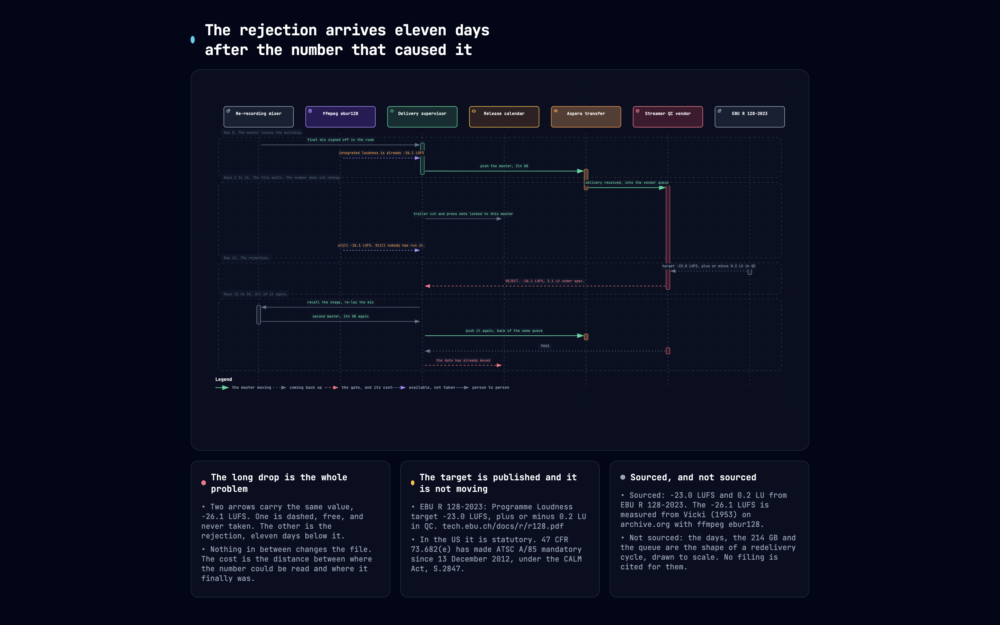
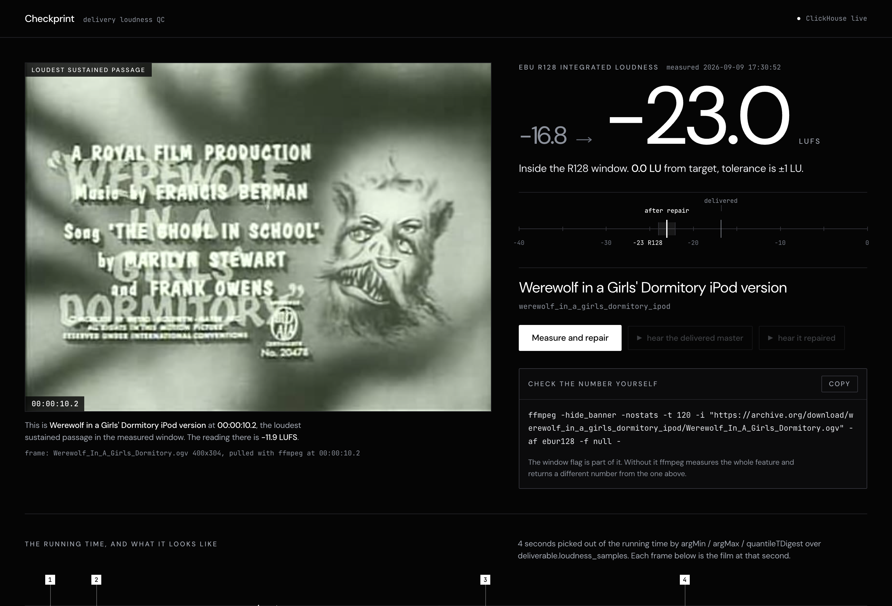
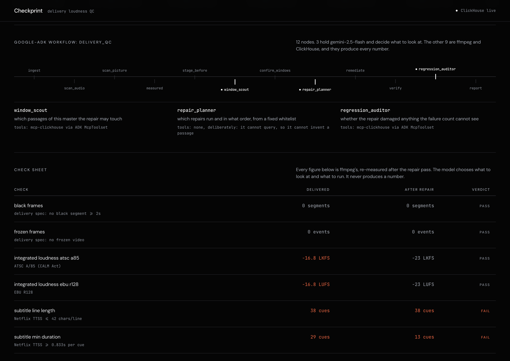
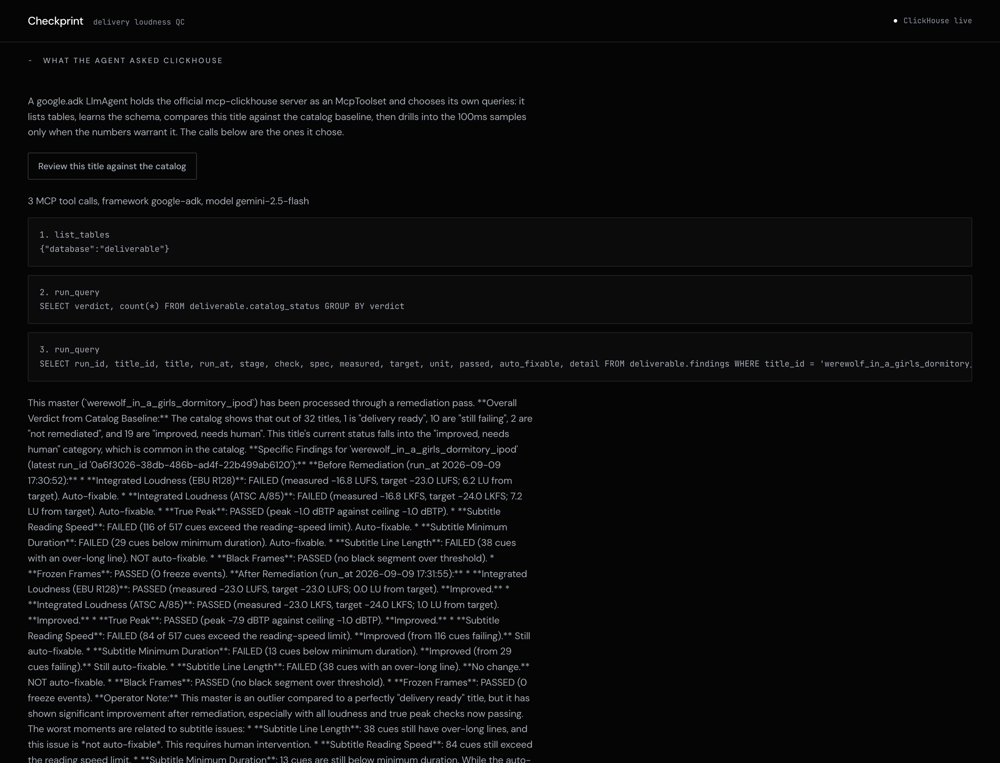
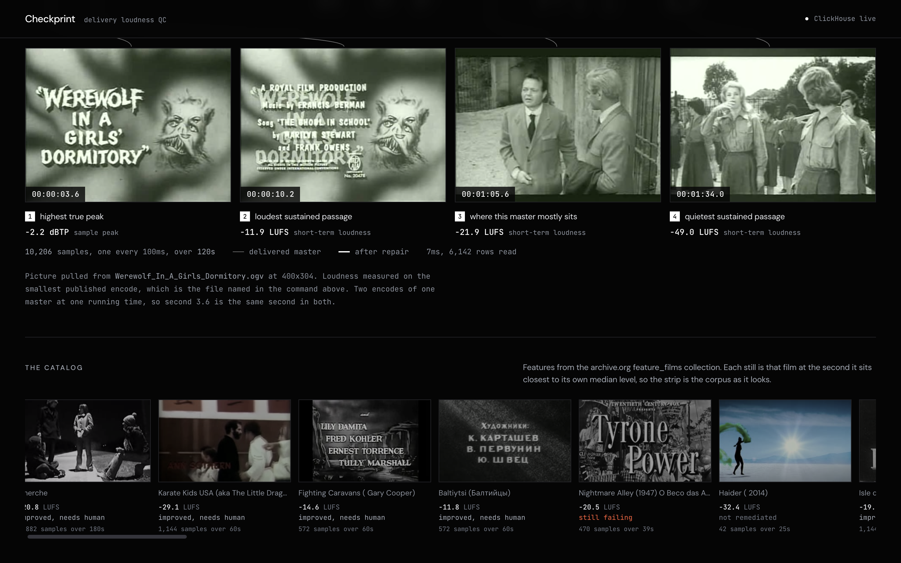

# Checkprint

The Devpost submission, field by field. Every figure below carries the command that
produced it.

---

## 1. Project name

**Checkprint**

## 2. Elevator pitch

> Measures a delivery master against EBU R128, repairs it in ffmpeg, then measures the repair. One film went -16.8 to -23.0 LUFS in 63 seconds, and one command re-measures the first number.

**187 characters**, against Devpost's 200 limit.

---

## 3. About the project



Read that diagram top to bottom, because the vertical axis is time. The same value,
-26.1 LUFS, appears on it twice. Once near the top as a dashed arrow that costs about
forty seconds of CPU and is never taken, and once at the bottom in red, as the
rejection. The tall empty band between them is the product. Nothing in it changes the
file. That distance is the entire cost, and it is bought by not running one command.
Its third card is explicit about which of its figures are sourced and which are the
shape of a redelivery cycle drawn to scale rather than a cited filing.

What follows is one file's case history. A real film, a real number, a real repair, and
the same number measured again afterwards. Everything Checkprint does happens to this
file in the next few hundred words, in order.



### The file, as delivered

*Werewolf in a Girls' Dormitory*, the iPod encode published on archive.org. Its first
120 seconds measure **-16.8 LUFS** integrated. EBU R128 clause h sets the target at
-23.0 LUFS with a tolerance of ±1.0 LU, so this master is **6.2 LU too loud**, six
times the whole permitted deviation.

Nobody has to take that on trust. It is one command against a public file, with no
account and no clone:

```bash
ffmpeg -hide_banner -nostats -t 120 \
  -i "https://archive.org/download/werewolf_in_a_girls_dormitory_ipod/Werewolf_In_A_Girls_Dormitory.ogv" \
  -af ebur128 -f null -
```

Look for `I: -16.8 LUFS` in the summary. The `-t` flag is part of the command, not
decoration: every figure here is a measurement of a stated window, and without it
ffmpeg reads the whole feature and returns something else. Do not add `-loglevel
error` either, because it suppresses the `ebur128` summary and you get nothing at all.

The same 120 seconds fail four more ways. The subtitle track carries 517 cues, and 116
of them run past the Netflix Timed Text Style Guide's 17 characters per second, 29 sit
under the 5/6 second minimum duration, and 38 carry a line over 42 characters.

### What happens to a file like that

It gets delivered anyway, because nobody measured it. The numbers above are not
subjective: a loudness target is a published threshold with a legal shadow behind it,
the CALM Act for US broadcast and each platform's delivery spec for streaming. But
delivery QC is still routinely done by ear, and a master that sounds fine at the desk
sounds 6.2 LU hot to a meter.

The rejection comes back through a queue. A redeliver is a new upload, a new slot in
somebody's QC pipeline and a new human pass, so it is measured in days rather than
minutes, and the title sits out of the catalogue for all of them. The expensive part
was never the fix. It was that the number was not measured before the file went out.

### The run

The full pass over this master, on the live service:

| Stage | ClickHouse `run_at` | What ran |
|---|---|---|
| before | 2026-09-09 17:30:52 | ffmpeg `ebur128`, 1,201 samples at one every 100 ms, written to ClickHouse |
| after | 2026-09-09 17:31:55 | the repaired file re-measured, second stage written alongside the first |

**63 seconds**, end to end, for the round trip that otherwise comes back through a
queue. Both timestamps are ClickHouse's own, read back through the MCP server by the
review agent in the screenshot further down.

In between, twelve nodes run as a `google.adk.workflow.Workflow`:

| Node | What runs | Who decides |
|---|---|---|
| `ingest` | fetch the master and its subtitle track | deterministic |
| `scan_audio` | ffmpeg `ebur128`, ten readings a second | deterministic |
| `scan_picture` | black, frozen and the subtitle battery | deterministic |
| `measured` | `JoinNode`, waits for both scans | join |
| `stage_before` | write the verdicts and the 100 ms series | deterministic |
| `window_scout` | writes its own SQL to locate the failing passages | **Gemini + mcp-clickhouse** |
| `confirm_windows` | re-derive every window from the table itself | deterministic |
| `repair_planner` | choose the repairs and their order, from a fixed whitelist | **Gemini** |
| `remediate` | ffmpeg: attenuate the located passages, then normalise | deterministic |
| `verify` | re-measure the repaired file and record the delta | deterministic |
| `regression_auditor` | compare the two stages for damage a failure count cannot see | **Gemini + mcp-clickhouse** |
| `report` | assemble the operator note | deterministic |

Three of the twelve hold a model. The other nine are ffmpeg and SQL, and they produce
every number that reaches a verdict. On this title `window_scout` located zero
passages, which is the correct answer: a 1960s optical soundtrack that is already too
loud needs attenuation everywhere, and one constant gain answers it. A tool that finds
something to repair on every file is a tool whose findings mean nothing.



### The file, after

| EBU R128 integrated loudness | Measured | Verdict |
|---|---|---|
| as delivered | **-16.8 LUFS** | FAIL, 6.2 LU over target |
| after the repair | **-23.0 LUFS** | **PASS, 0.0 LU from target** |

The first row is the ffmpeg command above. The second row is this, against the live
service, which reads the number back out of ClickHouse rather than out of a caption:

```bash
curl -s https://deliverable-387894104564.us-central1.run.app/api/title/werewolf_in_a_girls_dormitory_ipod \
  | jq '.after[] | select(.check=="integrated_loudness_ebu_r128") | .measured'   # -23.0
```

That pair is the whole product. Measuring a master is a solved problem and there are
several good tools for it. The part that is not solved is the second measurement:
running the meter over the file you just repaired, storing that reading beside the
first one on the same sample grid, and refusing to call the run finished without it. A
repair nobody re-measured is a claim, and a delivery operator cannot ship a claim.

True peak moved with it, -1.0 dBTP to -7.9. The subtitle track went from 116 cues over
the reading-speed limit to 84, and from 29 under minimum duration to 13, by extending
cue out-times into space that was genuinely free.

### Where it stops and hands to a person

The 38 over-long subtitle lines came out of the run as 38 over-long subtitle lines,
untouched, each one timecoded. Extending a cue into free space is arithmetic. Choosing
which of somebody's words to cut is not, and a machine that makes that call quietly has
done damage nobody asked for.

The same rule governs the rest of the boundary:

- **A black segment is measured, never auto-repaired.** Two seconds of black is a reel
  change, a fade, or damage, and those are indistinguishable to a detector.
- **A quiet passage is reported, never lifted.** A 100 ms loudness series cannot
  separate a whispered line after an explosion from a mastering mistake, so the
  remediator only ever attenuates.
- **A correction over 6 dB is escalated.** Past that it is a mastering decision rather
  than a delivery fix.
- **A check that nothing looked at is never reported as a pass.** An asset with no
  video stream produces no black frames, which is a different fact from having none.
  Those checks come back marked not measured, get no row in ClickHouse, and cannot make
  a report clean.

Each of those is a place the tool could have produced an answer and declines to. A gate
that answers everything answers nothing, so the refusals are what make the remaining
figures worth reading.

---

## 4. Inspiration

A file, and a threshold, both public.

*Werewolf in a Girls' Dormitory* is on archive.org, free to anyone. One ffmpeg command
reads its first 120 seconds at **-16.8 LUFS**. EBU R128 clause h says the target is
-23.0 LUFS with ±1.0 LU of tolerance, quoted from
[tech.ebu.ch/docs/r/r128.pdf](https://tech.ebu.ch/docs/r/r128.pdf), and those two
numbers are `EBU_R128_TARGET_LUFS` and `EBU_R128_TOLERANCE_LU` in `qc/measure.py`,
pinned by a test so the code and the citation cannot drift apart.

So there is a real rejection sitting on a real file that a stranger can confirm in
about a minute without touching this repository. That is a rare thing in film work,
where "correct" is usually an opinion. Delivery QC is one of the few places where it is
a number with a published threshold, and it is still routinely done by ear.

Doing it by ear is not a solved problem that somebody forgot to switch off. On 11 March
2025 the FCC opened a fresh rulemaking on the CALM Act, the statute that made
programme loudness a legal matter in the United States. Its own footnote 4 gives the
reason:

> Based on Commission data, in 2024 the Commission received at least 1,700 complaints
> referencing loud commercials that appear to relate to broadcast television, cable,
> and satellite, after receiving approximately 750 in 2022 and 825 in 2023.
>
> FCC, *Implementation of the Commercial Advertisement Loudness Mitigation (CALM) Act*,
> [FR Doc. 2025-03800](https://www.federalregister.gov/documents/2025/03/11/2025-03800/implementation-of-the-commercial-advertisement-loudness-mitigation-calm-act),
> n.4

The same document notes the rules have been in effect for over 12 years. Complaints
more than doubled between 2023 and 2024, and the regulator reopened the file rather
than closing it. That is a rule everyone has had over a decade to comply with, getting
measurably worse. It covers advertising loudness on broadcast and MVPD rather than
feature delivery to a streamer, so it is the neighbouring room rather than this one,
but it dates the problem to last year instead of to 2010.

Everything in Checkprint is built to hold the standard in that first paragraph. If a
figure appears on the page, the command that produced it appears next to it.

## 5. What it does

Checkprint takes a master, measures it against the delivery spec, repairs what is
deterministically repairable, and then **measures the repair**.

Measurement covers integrated loudness against EBU R128 (-23 LUFS ±1) and ATSC A/85
under the CALM Act (-24 LKFS ±2), true peak against -1.0 dBTP, subtitle reading speed,
cue duration, line length and line count against the Netflix Timed Text Style Guide,
plus black and frozen frame detection. Loudness is sampled every 100 ms, so a scan is a
time series rather than a verdict, and that series goes to ClickHouse.

The repaired file is re-measured and the second stage is written alongside the first,
on the same sample grid, which is what makes the delta inspectable rather than
asserted. The run refuses to report a repair with no re-measurement behind it: if the
graph stops before `verify`, `run_pipeline` raises and names the steps that completed.

Across the catalog the live service holds, 32 titles have been measured:

| Verdict | Titles |
|---|---|
| improved, needs a person | 19 |
| still failing | 10 |
| not remediated | 2 |
| delivery ready | 1 |

```bash
curl -s https://deliverable-387894104564.us-central1.run.app/api/catalog \
  | jq -r '.via, ([.catalog[].verdict] | group_by(.) | map({(.[0]): length}) | add)'
```

That `via` field comes back `mcp-clickhouse`, because the catalog is read through the
MCP server rather than around it.

The honest shape of the boundary is in "Where it stops and hands to a person" above,
placed there rather than at the end, because it is the part of the design that decides
what the rest of the numbers are worth.

## 6. How we built it

**The graph is an ADK `Workflow`, not a wrapper round a for loop.** Twelve nodes built
with `node`, `START`, `JoinNode` and `RetryConfig` from `google.adk.workflow`, the
current orchestration primitive in ADK 2.8. `SequentialAgent`, `ParallelAgent` and
`LoopAgent` still run but all three carry `@deprecated("... in favor of Workflow ...")`
in the installed wheel, and a test fails if any of them reappears. `scan_audio` and
`scan_picture` are two independent ffmpeg processes that fan out and rejoin at a
`JoinNode`, so the parallelism is structural. Model nodes carry
`RetryConfig(max_attempts=4, initial_delay=2.0, backoff_factor=2.0)` per node, because
a QC pass that has already spent forty seconds of ffmpeg should not be thrown away
because Gemini answered 429 for two seconds.

**ClickHouse is reached through the official `mcp-clickhouse` server**, held as an ADK
`McpToolset` over `StdioConnectionParams`. The agents call `list_tables` and `run_query`
like any other MCP client, and the queries they choose come back to the UI alongside
the prose, so the reasoning can be checked against the SQL behind it.



Three calls, chosen by the agent, in that screenshot: `list_tables` on `deliverable`,
then `SELECT verdict, count(*) FROM deliverable.catalog_status GROUP BY verdict` to
learn what normal looks like across the catalog, then a read of `deliverable.findings`
filtered to this title. Nobody wrote those by hand.

**Every MCP call passes an ADK `before_tool_callback` first.** `select_only` in
`agent/agents.py` admits a statement only if it reads: a `SELECT`, or a `WITH` whose CTE
bodies stay inside a five-table allowlist, in which case the statement's own CTE aliases
are accepted as readable names too. `DROP`, `TRUNCATE`, and an `ALTER TABLE ... DELETE`
smuggled in behind a SQL comment are all refused, and the refusal is returned to the
model as a tool result so it can try a different query rather than crash. The fence is
asserted by a sweep over every agent factory in the package rather than by naming the
agents one at a time, because a per-agent test stays green the day somebody adds a
fourth agent.

**ClickHouse is doing work a row store would not enjoy.** `ebur128` emits ten readings a
second, so one 90-minute feature is roughly 54,000 rows and a 500-title catalog is
around 27 million. This one title carries 10,206 samples across its two stages, and the
percentile query behind the sustained-loudness chart came back in 8 ms having read
24,576 rows, which is read out of `system.query_log` rather than timed with a
stopwatch. The scout's own SQL is not a primary-key lookup either: it is gap-and-island
grouping with `ROW_NUMBER() OVER` that finds contiguous runs of offending 100 ms samples
and discards the short ones, recorded verbatim in the `sql` column of
`deliverable.fail_windows`.



Those four frames are the film itself, pulled with ffmpeg at seconds ClickHouse picked
out of the loudness series: the highest true peak, the loudest and quietest sustained
passages, and the second this master mostly sits at. The picture on the page is
evidence, not decoration.

**Gemini is load bearing, and that is provable by removing it.** `run_pipeline` calls
`require_model()` first and raises `GeminiRequired` with no offline fallback, asserted
by `test_pipeline_refuses_without_model`, which strips `GOOGLE_API_KEY`,
`GEMINI_API_KEY`, `GOOGLE_GENAI_USE_VERTEXAI` and `GOOGLE_CLOUD_PROJECT` from the
environment and requires the run to raise rather than continue. A fallback that produced
the same plan shape would make the model decorative, since you could delete Gemini and
the product would behave identically. The run refuses to start without a reachable MCP
server for the same reason, asserted by `test_pipeline_refuses_without_mcp`.

```bash
.venv/bin/python -m pytest tests/test_gemini_required.py -q      # 9 passed
```

Serving is Cloud Run, Gemini runs on Vertex AI, ClickHouse Cloud holds the telemetry,
and ffmpeg does every measurement and every repair.

## 7. Challenges we ran into

**A check that could not fail.** ffmpeg's `blackdetect`, `freezedetect` and
`silencedetect` write their findings to stderr at log level INFO, and the detection pass
parses stderr. Add `-v error` to that command, which looks like tidying up, and every
finding disappears while the exit code stays 0. A file with a genuine defect then
measures clean and the picture check can no longer fail at all. It was caught by
injecting a known defect and confirming the check went red, and it is now pinned by
`test_quieting_ffmpeg_would_blind_the_detector_parser`, which runs both commands against
a file with real black frames and asserts the quieted one finds nothing.

**Absence rendered as success.** `run_qc` guarded loudness with `has_audio` but ran the
picture checks unconditionally. On an asset with no video stream `blackdetect` emits
nothing and exits 0, so "0 black segments" was recorded as a pass. Same content, video
stripped:

```
with video (genuine black frames):  black_segments=1  black_frames passed=False
audio only, video track stripped:   black_segments=0  black_frames passed=True
```

A 0 meaning "nobody looked" was printing identically to a 0 meaning "nothing found",
which is the one defect a re-measurement product cannot have. The picture checks are now
guarded by `has_video`, an unexamined check is a third state that gets no row in
ClickHouse and cannot make a report clean, and the repaired file carries its source
video stream through by an explicit map and copy so `verify` re-measures the same checks
the first pass measured. Removing the guard, or replacing the video map with `-vn`,
turns the two new tests red.

**Two packages, one protocol, incompatible pins.** `google-adk` pins `mcp>=1.24,<2`.
`mcp-clickhouse` needs `fastmcp>=4`, which wants `mcp>=2`. Installing both into one
environment leaves an executable on disk that dies at import, and the MCP client surfaces
that as `Connection closed`, which reads like a network fault and sends you debugging the
wrong layer. The fix came from remembering what MCP is: a subprocess protocol. The server
does not need to share an interpreter, it needs to be runnable. It lives in its own
virtualenv, `MCP_CLICKHOUSE_BIN` points at it, and `_server_works` probes a candidate by
asking its shebang interpreter to import `mcp_clickhouse` before trusting it.

**A scout with no tools does not stop having opinions.** The first time the graph ran end
to end, the MCP subprocess had already died at startup. The scout returned five passages
with entirely plausible timecodes, one of them 1782 seconds into a sixty second scan.
Nothing errored and the output looked like work. The run now refuses to start unless the
server answers a real `list_tools`, and every window the scout returns is re-derived from
`loudness_samples` before anything is allowed to touch audio.

**A published command that stopped reproducing its number.** The catalog's oldest record
for this title read -16.1 LUFS while the command the app published alongside it returned
-16.8, because the stored row predated a change in how the measurement window was
recorded. A reproduce command that does not reproduce is worse than no reproduce command,
so the title was re-run and the record now agrees with the command exactly. Three other
titles were checked the same way against their own published commands: *Go Down, Death!*
at -32.5 and *Isle of Destiny* at -19.5 matched exactly, *Citizen Kane* came back -17.7
against a stored -17.8.

**Single-pass `loudnorm` made a file worse.** It runs in dynamic mode and measurably moved
a -24.3 LUFS file to -25.3, further from spec than it started, while still changing the
number enough to satisfy a naive "did it move" assertion. The `verify` step caught it,
which is the entire argument for having a `verify` step. Two pass now, with a regression
test that requires landing rather than moving.

## 8. Accomplishments that we're proud of

The headline number survives contact with a stranger. The command in this document was
run from a clean shell against the public file and returned `I: -16.8 LUFS`, matching the
number the live page prints. Most demos ask you to trust a screenshot of a dashboard
built over data you cannot reach.

Beyond that: Gemini wrote non-trivial analytical SQL that nobody hand-authored, and it is
on the record in a table you can query. The agents can read the QC ledger and structurally
cannot write to it. And the suite has teeth, which was tested rather than claimed:

```bash
CHECKPRINT_URL=https://deliverable-387894104564.us-central1.run.app \
  .venv/bin/python -m pytest tests/ -q     # 112 passed
```

Twenty-one of those guard a specific guarantee, and each was confirmed able to fail by
breaking the guarantee in the production code, watching the test go red, and restoring
it. The list, and which guarantee each one holds, is in the README.

## 9. What we learned

MCP being a subprocess protocol is not trivia, it is the escape hatch from Python
dependency resolution. Two packages that cannot share an environment can still share a
workflow.

Fewer tools made a model more trustworthy, not less. `repair_planner` holds no tools at
all, which is precisely why it cannot fabricate a passage. The failure mode we hit was
never a model refusing to answer. It was a model answering confidently with its data
source dead, and no exception anywhere in the stack.

Splitting the decision from the arithmetic is where the agent earns its place. The model
picks where to look and what to repair; Python computes the dB and ffmpeg produces every
figure. That split is exactly why every claim here is reproducible.

An HTTP 200 is not a working input, a green test is not a working check, and a zero is
not a measurement. Each of those cost a debugging session before it became a rule.

## 10. What's next for Checkprint

Full-feature scans rather than bounded windows. The pipeline already handles them and
simply takes minutes per title, so this is a scheduling problem rather than a correctness
one.

Delivery profiles per platform, since -23 LUFS is EBU's number and each streamer
publishes its own spec on top of it. The thresholds are already constants pinned to their
citations, so the shape is a profile table rather than a rewrite.

Subtitle line rewriting stays with a person, on purpose, and is not on this list.

## 11. Built with

Python, Google Agent Development Kit (ADK 2.8), `google.adk.workflow.Workflow`,
`JoinNode`, `RetryConfig`, `McpToolset`, `before_tool_callback`, Gemini 2.5 Flash,
Vertex AI, Google Cloud Run, ClickHouse Cloud, mcp-clickhouse (official MCP server),
Model Context Protocol, FastAPI, ffmpeg, ebur128, EBU R128, ATSC A/85, Netflix Timed Text
Style Guide, pytest, HTML, CSS, JavaScript

---

## Links

**Live app:** <https://deliverable-387894104564.us-central1.run.app>

`/api/health` returns the connected ClickHouse version. `/api/catalog` returns the 32
measured titles and reports `"via": "mcp-clickhouse"`. `/api/title/{id}` hands back the
exact ffmpeg command for whichever title is on screen, built from the media URL and the
window that measurement was taken over.

**Repo:** <https://github.com/kamalbuilds/checkprint>

MIT licence. The pushed source is the service you can click: the ADK workflow, the three
model nodes, the MCP read guardrail and the tests.
